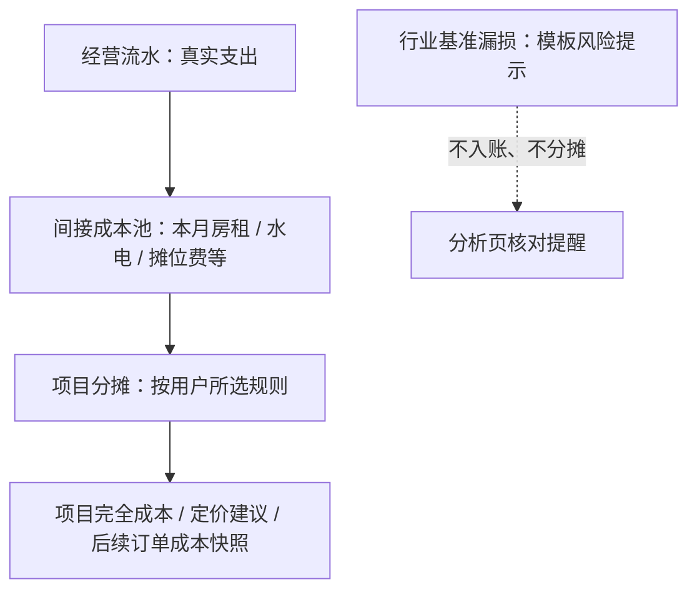

# 可配置间接成本与项目分摊：需求审计与方案选择

**状态：待选择，尚未开发。**

## 结论先行

当前“行业隐形成本”卡的定位应当收窄为**行业风险提示**，而不是承担房租、水电、摊位费等已经发生或计划发生的实际成本。后者应改为单独的“间接成本池”，由商家录入金额并选择受影响的商品或服务项目；系统再按一个可解释的规则分摊到每个项目。这样，用户能同时看到“账上已经发生的费用”“项目的完整成本”和“尚待核对的行业漏损”，三者不会混在一起。

> 推荐以**方案 A：引导式成本池**作为首版。它以“每月录一次成本池、选择一个简单分摊规则、自动分到项目”的三步操作解决 80% 的常见场景；再预留升级至方案 B 的数据结构，而不让小商家一开始面对复杂的成本中心、工时或多层分摊表。

## 一、现状审计：目前缺少的不是一个卡片，而是三类成本的边界

现有成本卡只保存“材料、人工、固定分摊”三个**单件金额**；`overhead` 是直接手填的数字，无法追溯到某笔房租、水电或摊位费，也不能告诉用户不同项目为什么分到不同金额。[1] 现有“行业隐形成本”则是按行业模板率和当前月收入/分类金额做的基准估算，并已明确不计入正式利润。[2] 这两个入口都无法满足“我本月付了 ¥X 房租，要让指定项目各承担多少”的实际经营问题。

| 现有能力 | 当前口径 | 暴露的问题 | 用户真正需要的能力 |
| --- | --- | --- | --- |
| 流水分类 | 将摊位费、房租水电等作为支出归入当期经营费用 | 只能看到总额，不能反映到具体商品/服务的单位成本 | 将已记的间接费用组织为可分摊成本池 |
| 成本卡“固定分摊” | 直接为单个项目输入一个单位金额 | 无来源、无月份、无规则；多个项目容易重复或漏分 | 从同一成本池按统一规则自动算出单件/单次分摊 |
| 智能定价 | 使用材料 + 人工 + 固定分摊计算单位完全成本 | 固定分摊依赖人工抄数，定价无法解释成本变动 | 自动使用当前分摊结果，并说明本期来源 |
| 行业隐形成本 | 模板费率 × 收入/分类基数的风险估算 | 与实际房租、摊位费等混在视觉上，容易被误读为账务成本 | 保留为“行业提醒”，不参与分摊或利润计算 |

### 关键问题

第一，**实际费用与估算风险混淆**。截图中的“摊位费占比”来自营收的固定比例估算，而用户需要录入真实摊位费并决定它影响哪些货品；二者不能再同名呈现。

第二，**项目成本缺少来源链路**。今天的“固定分摊 ¥0.80/份”只能说明结果，不能回答“它来自哪一笔费用、按什么规则分到这里”。这会让定价页看似精确，实际却不可审计。[1]

第三，**不能处理不同项目的资源消耗差异**。高价商品、畅销品、重人工服务和仅售少量的项目，未必应该平均承担房租或水电；强制只留“均摊”会让用户误以为系统已经做了公平分配。

第四，**分摊结果不能改写历史订单**。现有订单会冻结下单时的单位成本，保障历史毛利不被后来成本卡修改重算。[3] 新功能必须沿用这一原则：修改未来月份的分摊计划，只影响之后的成本卡、定价建议和新订单；已成交订单保留快照。

第五，**用户录入负担必须受控**。小商贩、餐饮小店和美业工作室通常没有完整工时、面积、项目销量等数据。如果首版要求“成本中心 + 工时表 + 面积表”，功能将被放弃使用。

## 二、统一的产品边界：三本账，不混算



| 层级 | 举例 | 是否写入经营流水 | 是否计入正式利润 | 是否进入项目单位成本 |
| --- | --- | --- | --- | --- |
| 直接成本 | 原料、包装、单件快递、项目耗材 | 是 | 是 | 是，直接归属 |
| 间接成本池 | 房租、水电、摊位费、基础人工、设备折旧 | 是或用户建立“计划池” | 已入账部分计入；计划部分单独标记 | 是，按分摊规则进入“管理口径完全成本” |
| 行业基准漏损 | 食材损耗参考、空置损失参考、无效投放风险 | 否 | 否 | 否，仅作为风险提醒 |

这里的关键设计是：**正式经营利润**继续只使用已入账流水；而**项目完全成本**可在定价场景中显示“含本期已分摊间接成本”的管理口径。两种口径并列展示，避免用户误以为尚未支付的计划房租已经从利润中扣除。

## 三、方案 A：引导式成本池（推荐）

### 适用对象与核心价值

方案 A 面向小商贩、餐饮小店、零售店和刚开始建立商品成本的电商商家。它只要求用户回答三件事：**是什么费用、这一期多少钱、要按什么方式分给哪些项目**。系统会把复杂的会计术语隐藏在“分摊方式”之后。

| 配置步骤 | 用户看到的语言 | 系统动作 |
| --- | --- | --- |
| 1. 新增成本池 | “本月要分摊什么费用？” | 选择摊位费、房租、水电、基础人工、设备折旧或自定义；可关联已记流水或录入计划金额。 |
| 2. 选择项目 | “这笔钱影响哪些商品/服务？” | 默认勾选当前行业所有在售项目，用户可取消不受影响的项目。 |
| 3. 选择规则 | “怎么分比较合适？” | 选择按销量、按营业额、平均分或自定义比例；系统显示一句解释与预计每件金额。 |
| 4. 查看结果 | “每个项目多承担多少？” | 显示本期总额、已分配比例与前三个项目的单位分摊；进入项目成本可展开来源。 |

### 规则设计

| 分摊方式 | 用户说明 | 推荐场景 | 计算方式 | 无数据时的回退 |
| --- | --- | --- | --- |
| 按销量 | “卖得多的项目多承担” | 摊位费、包装间接费、基础人工 | 项目销量 ÷ 选中项目总销量 | 本期无销量时提示选择“平均分”或输入比例，不自动猜测。 |
| 按营业额 | “卖得多、卖得贵的项目多承担” | 房租、平台运营、门店基础费用 | 项目净营收 ÷ 选中项目净营收 | 无收入时不分摊，保持待补数。 |
| 平均分 | “每个项目均分” | 项目较少且重要性相近 | 1 ÷ 选中项目数量 | 永远可用；但明确提示未考虑销量差异。 |
| 自定义比例 | “我自己决定各项目占比” | 用户最了解资源占用差异 | 用户比例 ÷ 100，合计必须为 100% | 按钮禁用直至合计为 100%。 |

### 移动端交互草图

```text
分析 / 项目成本页
┌──────────────────────────┐
│ 间接成本池                     + 新增 │
│ 本月已分摊 ¥2,600  ·  3 个项目          │
├──────────────────────────┤
│ 房租水电  ¥1,800  按营业额      > │
│ 摊位费    ¥800    按销量        > │
├──────────────────────────┤
│ 项目完全成本（管理口径）               │
│ 烤肠：直接 ¥3.60 + 分摊 ¥0.72  = ¥4.32 │
│ 饮料：直接 ¥2.00 + 分摊 ¥0.39  = ¥2.39 │
└──────────────────────────┘

新增成本池（单屏三步）
费用类型 → 本期金额 / 关联流水 → 项目 + 分摊方式 → 保存并预览
```

### 数据模型与历史规则

方案 A 使用两类对象。`IndirectCostPool` 记录费用池的金额、期间、来源（关联流水/计划金额）和是否影响正式利润；`AllocationPlan` 记录项目范围、方法、权重快照和当期结果。成本卡不再持久化一个无法解释的 `overhead`，而是运行时汇总该项目在当前期间的分摊结果。

订单仍冻结“下单当日的直接成本 + 已生效分摊成本”快照。下一期调整房租或更换规则，只更新新的定价建议和后续订单，符合当前 SKU / 订单历史不回写原则。[3]

### 优点与限制

方案 A 的优点是学习成本低、录入次数少、解释清楚且适合移动端。限制是按销量或营业额的准确性依赖订单数据；没有订单的小商家需要选择平均分或手动比例。首版不支持按面积、工时、机时等复杂动因。

## 四、方案 B：成本中心 + 项目比例表（专业版）

### 适用对象与核心价值

方案 B 面向 SKU 较多、经营者对项目资源占用有明确判断的零售、电商和美业商家。它将费用拆成多个“成本中心”，每一个成本中心都能选择不同的项目范围和百分比分配。例如，仓储费只分给仓储商品，门店房租只分给到店项目，技师底薪只分给指定服务。

| 配置步骤 | 用户操作 | 结果 |
| --- | --- | --- |
| 1. 建成本中心 | 创建“门店”“仓配”“内容投放”“技师团队”等 | 先建立费用归属边界，而非直接编辑单品。 |
| 2. 录费用 | 每月录入或关联流水 | 每项费用进入指定成本中心。 |
| 3. 配项目比例表 | 勾选项目，并为每个项目输入比例 | 例如“门店：咖啡 60%、甜品 40%”。 |
| 4. 锁定本期 | 预览并确认 | 生成该月分摊快照，供成本卡、定价和报表查询。 |

### 移动端交互草图

```text
成本中心：门店费用
┌──────────────────────────┐
│ 本月 ¥4,600   已关联 3 笔流水               │
│ 分给：咖啡、甜品、轻食                     │
├──────────────────────────┤
│ 咖啡       60%       ¥2,760               │
│ 甜品       25%       ¥1,150               │
│ 轻食       15%       ¥690                 │
│ 比例合计 100%                              │
└──────────────────────────┘
```

### 优点与限制

方案 B 最透明、最接近商家真实经营判断，并能逐步扩展到按面积、工时、订单量或设备时长等动因。但它要求商家理解“成本中心”和百分比分配，设置时间更长，特别不适合只有一两个项目或从未维护订单数据的用户。

## 五、方案 C：快速单品加成（不建议作为主方案）

方案 C 仅保留成本卡中的“固定分摊”字段，但把它改名为“每件间接成本加成”，并提供一个批量复制动作。它上线最快，却仍然不能说明房租、水电、摊位费的来源，无法避免重复分摊，也不适合月度经营分析。因此只能作为从旧数据平滑迁移的临时兼容层，不能作为用户的新入口。

## 六、方案比较与推荐

| 维度 | 方案 A：引导式成本池 | 方案 B：成本中心 + 比例表 | 方案 C：快速单品加成 |
| --- | --- | --- | --- |
| 操作复杂度 | 低，三步完成 | 中高，需要维护中心和比例 | 最低 |
| 可解释性 | 高，可追溯费用与规则 | 很高，可追溯中心、费用和比例 | 低 |
| 分摊公平性 | 中高，取决于选择的动因 | 高，适合复杂资源占用 | 低 |
| 小商家适配 | 最佳 | 一般 | 表面简单但易失真 |
| 多项目/多费用扩展 | 好 | 最佳 | 差 |
| 首版开发与验证成本 | 中 | 高 | 低 |
| 推荐结论 | **首版采用** | 作为方案 A 的高级模式 | 仅作历史兼容 |

推荐的产品路线是：第一阶段落地方案 A 的四种规则，并将“自定义比例”作为高级入口；第二阶段当商家存在多个费用池或多项目比例表时，再在同一数据结构上开放方案 B 的“成本中心”。用户永远先看到“费用 → 项目 → 怎么分”这条浅路径，不必先理解会计术语。

## 七、必须先确定的产品规则

在开发前需要你确认以下四项，否则“分摊后成本”会在不同页面出现不同解释：

1. **分摊到什么层级？** 推荐先分摊到成本卡/SKU；餐饮、美业中的“菜品/服务项目”与此等价。
2. **实际费用与计划费用是否都支持？** 推荐两者都支持，并以“已入账 / 计划”标签区分；只有已入账费用影响正式经营利润。
3. **项目完全成本是否进入新订单成本快照？** 推荐默认进入，并在订单/定价页标记“含本期分摊”；历史订单不回写。
4. **是否允许同一笔流水进入多个成本池？** 推荐首版不允许，防止重复分摊；一笔流水只能关联一个成本池，解绑后才可改关联。

## 八、建议的实施顺序（在你选择方案后）

第一步先建立成本池、关联流水和四种分摊规则，并在分析页提供“本期已分摊 / 待分摊”的清晰总览。第二步把结果接入成本卡和智能定价，展示“直接成本 + 人工 + 间接分摊”的来源明细。第三步才扩展至成本中心、批量比例模板、跨月复制和更复杂的动因。整个过程不删除现有行业漏损卡，只将它改名为“行业风险提示”，保持不入账、不分摊的边界。

## References

[1] [成本卡模型与单位成本公式：`CostCard.overhead` 及 `calcCard`](../client/src/lib/cost-book.ts#L20-L21)

[2] [五行业基准漏损规则与分析页展示逻辑](../client/src/lib/cost-book.ts#L46-L52)

[3] [订单 SKU 成本快照与退款成本计算](../client/src/lib/order-ledger.ts)

[4] [成本卡编辑、详情与智能定价现有交互](../client/src/pages/Home.tsx#L912-L956)
