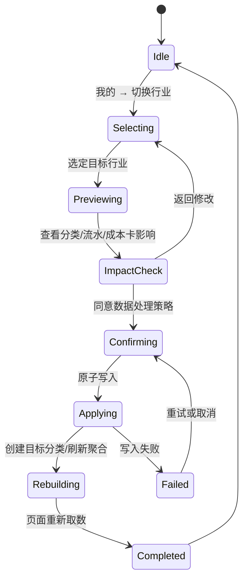

# 算得清：五行业模板切换与数据结构规格

**适用行业：** 餐饮、零售、电商、美业服务、小商贩。  
**目标：** 让行业模板不是一组首页文案，而是驱动分类、记账、成本卡、图表、预警和隐性成本计算的统一业务配置。

## 1. 设计结论

五个行业应共享**同一套账本核心**，但不能共享“同一组字段含义”。因此实现必须分成两层：第一层是不可随业务数据变化的 `IndustryTemplate` 配置；第二层是带有 `workspaceId` 与 `industryId` 的真实经营数据。页面不直接写死“菜品”“商品”等文案，而是根据当前模板读取实体术语、分类、指标和图表配置。

> **切换行业不是清空数据并覆盖分类。** 对已有商家而言，它必须是一次可审计的经营范围变更：历史流水、月报、成本卡和供应商关系保留在旧行业上下文中；新行业启用新的默认分类、成本卡字段、隐性成本模型和分析口径。

## 2. 五行业模板定义

| 行业 ID | 对外名称 | 成本卡实体 | 核心单位 | 默认分类（稳定 key） | 经营重点 |
|---|---|---|---|---|---|
| `canteen` | 餐饮 | 菜品 | 每份/每杯 | `food_purchase`、`labor`、`rent_utilities`、`marketing`、`logistics_storage`、`depreciation`、`other` | 食材损耗、BOM 理论成本率、水电浪费、临期过期 |
| `retail` | 零售 | 商品 / SKU | 件 | `goods_purchase`、`labor`、`rent_utilities`、`marketing`、`delivery`、`shrinkage`、`other` | 门店损耗、库存持有、滞销过时、周转 |
| `ecommerce` | 电商 | 商品 / SKU | 件 / 单 | `goods_purchase`、`platform_fee`、`fulfillment`、`ad_spend`、`warehouse_packaging`、`returns`、`labor`、`other` | 退款售后、平台结算、广告投产、库存资金占用 |
| `beauty` | 美业服务 | 服务项目 | 次 / 套 / 小时 | `materials`、`technician_labor`、`rent_utilities`、`marketing`、`depreciation`、`sundries`、`other` | 技师利用率、爽约、工位空置、产品耗材 |
| `stall` | 小商贩 | 货品 / 摊位套餐 | 件 / 份 | `purchase`、`stall_fee`、`transport_handling`、`clearance_loss`、`misc` | 货损、摊位费、出摊空档、尾货折价 |

### 2.1 模板元数据

模板必须使用稳定的业务 key，而不是根据中文名称做模糊匹配。中文名称可以更改，`categoryKey`、`entityType` 和规则 key 不应变化。下面的结构既能作为前端 Store 类型，也能作为未来 API 返回的配置结构。

```ts
type IndustryId = "canteen" | "retail" | "ecommerce" | "beauty" | "stall";

type IndustryTemplate = {
  id: IndustryId;
  version: number;
  label: string;
  description: string;
  icon: string;
  nouns: {
    entity: string;          // 菜品 / 商品 / 服务项目 / 货品
    entityPlural: string;
    formula: string;         // 配方 / 成本构成 / 服务耗用 / 进货构成
    transactionUnit: string; // 份 / 件 / 次 / 单
  };
  categoryPresets: CategoryPreset[];
  costCardSchema: CostCardSchema;
  dashboardMetrics: MetricDefinition[];
  chartConfig: ChartDefinition[];
  alertRules: AlertRule[];
  hiddenCostModel: HiddenCostDefinition;
};

type CategoryPreset = {
  key: string;              // 例如 goods_purchase，不使用 t1/t2
  label: string;
  color: string;
  expenseType: "variable" | "fixed" | "marketing" | "loss" | "platform";
  aliases: string[];        // 历史数据迁移映射，如 ["商品采购", "进货"]
};
```

### 2.2 成本卡字段差异

所有行业均使用 `CostCard`，但其输入构成与核算公式不同。页面只根据 `costCardSchema` 生成字段，避免为每个行业复制一套详情页。

| 行业 | 成本卡主字段 | 成本构成 | 关键结果 | 详情页动作 |
|---|---|---|---|---|
| 餐饮 | 菜品名、售价、出品份数 | 食材 BOM、人工、房租水电分摊 | 单份成本、毛利率、食材成本率 | 增删用料、重算、看单位成本趋势 |
| 零售 | SKU、售价、库存、周转天数 | 进货、物流、损耗、折扣 | 单件成本、毛利率、库存占用 | 更新进货批次、看周转与滞销 |
| 电商 | SKU、标价、实收、渠道 | 采购、佣金、履约、广告、退货 | 净贡献、退款率、渠道 ROI | 对账平台账单、查看渠道成本 |
| 美业服务 | 项目、定价、时长、技师 | 产品耗材、技师提成、工位分摊 | 单次成本、项目毛利、工时效率 | 更新耗材、排班/利用率查看 |
| 小商贩 | 货品、售价、摆摊批次 | 进货、摊位、搬运、损耗、折价 | 单件成本、日毛利、清尾损失 | 登记批次、更新损耗/尾货 |

## 3. 统一经营数据结构

原始原型中 `DB` 是唯一数据源，记录、成本卡、趋势、分类、供应商和报表共享相同口径。移动 App 应恢复这一原则，但将数据按工作空间和行业显式隔离。

```ts
type Workspace = {
  id: string;
  name: string;
  activeIndustryId: IndustryId;
  activeTemplateVersion: number;
  scale: "stall" | "single_store" | "multi_store";
  monthlyBudget: number;
  switchedAt: string;
};

type Record = {
  id: string;
  workspaceId: string;
  industryId: IndustryId;      // 历史记录永远保留发生时行业
  categoryKey: string;
  date: string;
  type: "expense" | "income" | "refund";
  amount: number;
  merchant: string;
  note?: string;
  status: "accounted" | "pending" | "abnormal";
  attachments: Attachment[];
  source: "manual" | "import" | "system";
  createdAt: string;
  updatedAt: string;
};

type CostCard = {
  id: string;
  workspaceId: string;
  industryId: IndustryId;
  templateVersion: number;
  entityType: "dish" | "sku" | "service" | "goods";
  name: string;
  categoryKey?: string;
  salePrice?: number;
  unit: string;
  costComponents: CostComponent[];
  cost: number;
  marginRate?: number;
  history: MonthlyPoint[];
  status: "healthy" | "attention" | "risk" | "archived";
};

type Supplier = {
  id: string;
  workspaceId: string;
  industryScope: IndustryId[] | ["shared"];
  name: string;
  contact?: string;
  categoryKeys: string[];
  spend: number;
  orderCount: number;
  status: "active" | "archived";
};

type MonthlyReport = {
  id: string;
  workspaceId: string;
  industryId: IndustryId;
  templateVersion: number;
  month: string;
  revenue: number;
  totalCost: number;
  grossProfit: number;
  marginRate: number;
  categoryBreakdown: CategoryAggregate[];
  chartSnapshot: ChartSnapshot;
};
```

### 3.1 必须遵守的数据规则

| 对象 | 必须携带的隔离字段 | 切换行业后如何处理 |
|---|---|---|
| 工作空间 | `activeIndustryId`、`activeTemplateVersion` | 更新为目标行业；记录切换日志 |
| 流水 | `workspaceId`、`industryId`、`categoryKey` | 不删除、不重写；默认列表显示当前行业，可打开“历史全部” |
| 分类 | `workspaceId`、`industryId`、`key`、`label` | 创建目标行业预设分类；共有 key 可复用；旧分类归档而非删除 |
| 成本卡 / BOM | `workspaceId`、`industryId`、`templateVersion` | 旧成本卡归档；新行业创建空模板或演示种子，禁止自动改成新实体 |
| 供应商 | `workspaceId`、`industryScope` | 可标为共享供应商；不符合新行业的供应商不在默认列表显示，但保留历史关联 |
| 报表 / 图表快照 | `workspaceId`、`industryId`、`templateVersion` | 已生成报表不可重算或重分类；新行业从切换日期起生成新口径 |
| 隐性成本 | `workspaceId`、`industryId`、`period`、`modelVersion` | 不迁移数值，使用目标行业模型重新计算 |

## 4. 行业切换状态机

行业切换应采用**预览—影响评估—确认—事务写入—查询失效—页面刷新**流程。当前演示版的“直接替换分类”只能用于全新演示数据，不能用于真实商家。



### 4.1 新商家首次选择

首次引导保持三步：选择行业、填写店铺/规模/预算、预览自动生成的分类。提交时创建 `Workspace`，写入目标模板版本、预设分类和空业务数据；若是演示模式，可额外写入对应行业的演示种子数据。首次选择不需要迁移或归档提示。

### 4.2 已有商家切换

已有数据时必须先计算影响：当前行业的流水数、未归档成本卡数、供应商数、当月未出报表数以及可一键映射的共有分类数。确认页采用“**未来数据使用新模板，历史数据保留原行业**”作为默认策略。任何生产数据均不得因为行业切换而删除或自动改写。

| 切换项 | 默认策略 | 允许的用户选择 |
|---|---|---|
| 历史流水 | 保留原 `industryId` | 查看当前行业 / 查看全部历史 |
| 共有分类 | 按稳定 key 复用，例如 `labor`、`rent_utilities`、`marketing`、`other` | 可编辑展示名称，不改变历史 key |
| 行业专属分类 | 旧分类归档，新行业生成预设分类 | 手动映射为目标行业分类；不做隐式映射 |
| 成本卡与 BOM | 归档为旧行业实体 | 复制为草稿仅允许同实体类型；跨实体类型必须新建 |
| 供应商 | 保留并标记 `industryScope` | 设为共享或仅旧行业可见 |
| 本月报表 | 使用旧行业快照封存 | 切换日后新口径单独汇总，不重写旧月报 |

### 4.3 事务伪代码

```ts
async function switchIndustry(input: {
  workspaceId: string;
  targetIndustryId: IndustryId;
  strategy: "future_only" | "manual_mapping";
  categoryMappings?: Record<string, string>;
}) {
  const impact = await api.getIndustryImpact(input.workspaceId, input.targetIndustryId);
  assert(impact.requiresConfirmation === false || input.strategy);

  await api.transaction(async (tx) => {
    const template = await tx.getIndustryTemplate(input.targetIndustryId);
    await tx.archiveIndustryCategories(input.workspaceId, impact.sourceIndustryId);
    await tx.upsertPresetCategories(input.workspaceId, template.categoryPresets);
    await tx.applyExplicitMappings(input.categoryMappings ?? {});
    await tx.updateWorkspace(input.workspaceId, {
      activeIndustryId: input.targetIndustryId,
      activeTemplateVersion: template.version,
      switchedAt: new Date().toISOString(),
    });
    await tx.appendIndustrySwitchLog({ ...input, impact, occurredAt: new Date().toISOString() });
  });

  await invalidate([
    "workspace", "overview", "records", "costCards", "analysis",
    "hiddenCost", "suppliers", "categories", "reports"
  ]);
}
```

## 5. 移动 App 页面刷新策略

| 页面 | 切换后立即刷新 | 默认筛选 / 路由行为 |
|---|---|---|
| 工作台 | 店铺名、行业图标、预算、KPI、风险、迷你趋势 | 保持“工作台”页；显示目标行业的最新周期 |
| 记账 | 分类 chips、商户建议、流水摘要 | 默认 `industryId = activeIndustryId`；提供“全部历史”开关 |
| 记一笔 | 分类、成本项标签、附件提示、商户占位 | 打开后重新读取模板，避免沿用旧行业分类 |
| 分析 | 周期、环图、趋势、TOP5、供应商排行、隐性成本 | 重新查询目标行业；切换前期缓存不可复用 |
| 行业成本卡 | 标题术语、筛选项、字段表单、单位、计算公式 | 回到成本卡列表顶端；旧行业入口仅在历史档案可见 |
| 成本卡详情 | BOM / 成本构成 / 单位成本趋势 | 旧页面被关闭；不得在新行业中展示不兼容实体 |
| 我的 | 店铺行业、模板版本、切换日志、预算 | 刷新配置卡并显示“已切换”结果反馈 |
| 报表 | 月报列表、图表快照、口径说明 | 使用 `industryId + templateVersion` 查询，明确历史报表口径 |

## 6. 图表与隐性成本的行业映射

| 行业 | 首页迷你趋势 | 分析主图 | TOP5 实体 | 隐性成本模型 |
|---|---|---|---|---|
| 餐饮 | 成本 / 营收 / 成本率 | 分类环图 + 6 月趋势 | 菜品 | 食材损耗、BOM 成本率漏损、水电浪费、库存过期 |
| 零售 | 成本 / 营收 / 周转 | 分类环图 + 库存趋势 | SKU | 门店损耗、库存持有、滞销过时 |
| 电商 | 成本 / 实收 / ROI | 分类环图 + 渠道趋势 | SKU | 退款退货、结算漏损、广告无效、库存资金占用 |
| 美业 | 成本 / 营收 / 利用率 | 分类环图 + 工时趋势 | 服务项目 | 工时空置、爽约、空置工位 |
| 小商贩 | 成本 / 营收 / 日均毛利 | 分类环图 + 出摊趋势 | 货品 | 货品损耗、摊位费占比、出摊空档、尾货折价 |

## 7. API 与查询边界

将原始 16 个接口保留为业务语义基础，并在需要行业上下文的读取接口上统一接收 `workspaceId` 与 `industryId`。行业切换增加两个接口，而不是让客户端直接替换数组。

| 接口 | 用途 |
|---|---|
| `GET /industry-templates` | 获取可用模板与版本，不含商家数据 |
| `GET /workspaces/:id/industry-impact?targetIndustryId=` | 返回切换影响、共有分类映射建议和需确认对象数量 |
| `POST /workspaces/:id/industry-switch` | 原子执行切换、归档、分类创建、显式映射与日志写入 |
| `GET /records?workspaceId=&industryId=&scope=current|all` | 默认查当前行业；历史范围由 `scope` 控制 |
| `GET /analysis?workspaceId=&industryId=&period=` | 返回环图、趋势、TOP5、供应商与隐性成本所需数据 |
| `GET /cost-cards?workspaceId=&industryId=` | 只返回当前行业兼容的成本卡实体 |

## 8. 实施顺序与验收

第一轮先抽离模板配置和统一数据层，再恢复行业分类、流水与切换影响预览。第二轮恢复行业成本卡和 BOM/成本构成计算；第三轮将图表、隐性成本、报表、供应商和分类管理接到同一查询边界。

| 验收场景 | 必须通过的结果 |
|---|---|
| 新商家选择电商 | 创建 8 个电商分类，记账表单显示佣金、履约、广告、退款等分类，分析页启用电商模型 |
| 餐饮商家切换美业 | 餐饮流水与菜品成本卡保留在历史档案，美业生成产品耗材/技师工资等分类，服务项目成本卡为空或来自美业种子 |
| 切换后返回工作台 | 店铺行业、预算、成本摘要、风险提示与图表均来自目标行业，页面没有旧分类残留 |
| 历史月报查看 | 报表明确标注原行业和模板版本，金额不因后续切换而改变 |
| 电商切换后记账 | 新记录写入 `industryId = ecommerce`，保存后流水、预算、构成图和隐性成本同时更新 |

## 9. 依据

本规格以原始原型的行业模板、三步引导、统一 `DB` 数据源、16 个 API 契约和行业隐性成本引擎为基线。原始实现在切换时直接覆盖 `DB.categories`，该方式只适用于新引导或演示数据；本规格将其扩展为可保留历史账本的生产级切换策略。
