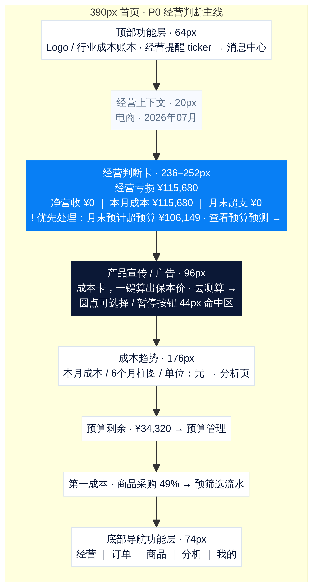

# 首页经营数据主线：P0 移动端布局与交互草图

**适用视口：** 390px × 844px 为基准，同时在 375px × 812px 与 430px × 932px 复核。  
**设计目标：** 首页首屏先完成一次经营判断，再呈现宣传与分析模块。用户在不滚动或仅轻微滚动的情况下，应看清行业、期间、本月成本、预算状态和唯一优先事项。



## 1. 最终信息顺序

首页不再让用户自行把顶部 ticker、利润卡、预算行与消息中心的信息拼成结论。P0 版本将它们组织为以下顺序：

| 纵向顺序 | 区块 | 高度目标 | 只回答一个问题 | 点击行为 |
|---:|---|---:|---|---|
| 1 | 顶部功能层 | 64px | 我在哪个账本中？是否有新提醒？ | ticker 打开消息中心。 |
| 2 | 行业与期间 | 20–24px | 当前以哪个行业和哪个月为口径？ | 无；行业切换留在“我的”。 |
| 3 | **经营判断卡** | 236–252px | 赚/亏多少？成本多少？预算是否失控？现在先做什么？ | 风险行动行进入预算、订单、商品或流水。 |
| 4 | 产品宣传/广告 | 96px | 有哪一项产品能力或合作广告值得了解？ | 进入对应产品页或后续广告链接。 |
| 5 | 成本趋势 | 176px | 成本处于上升还是下降？ | 进入分析页。 |
| 6 | 预算、第一成本 | 各 60px | 预算还剩多少？最大成本是什么？ | 分别进入预算与预筛选流水。 |
| 7 | 底部功能层 | 74px + 安全区 | 下一步去哪个一级业务区域？ | 一级 Tab 切换。 |

> **关键取舍：** Banner 保留在经营主卡之后，符合产品宣传/后续广告的商业定位；但必须低于经营判断簇，不得将风险、预算或成本状态放进广告轮播中。

## 2. 经营判断卡的布局草图

```text
┌──────────────────────────────────────────────┐
│ 电商 · 2026年07月                            │  ← 上下文，不抢占主标题
│                                              │
│ 经营亏损  ¥115,680                           │  ← 唯一 Display 数字
│                                              │
│ 净营收            本月成本          月末超支 │
│ ¥0                ¥115,680         ¥0       │  ← 三列可审计数值
│ ─ ─ ─ ─ ─ ─ ─ ─ ─ ─ ─ ─ ─ ─ ─ ─ ─ ─ ─ ─ │
│ !  优先处理   月末预计超预算 ¥106,149   ›   │  ← 可点击动作行
│    查看预算预测                               │
└──────────────────────────────────────────────┘
```

此卡由三个层级组成。第一层是轻量上下文，只含行业和期间；第二层是结果与三列核算，让利润、成本和预算同屏完成对照；第三层是唯一优先风险。风险行不是第四张卡，而是主核算卡内的**行动性结论**。这避免了当前“主卡回答利润、ticker 回答风险、预算行回答预算”的跨模块拼读。

### 2.1 视觉规则

| 部位 | 视觉处理 | 不应做的事 |
|---|---|---|
| 上下文 | 11–12px，低对比白/蓝文本，左对齐。 | 不使用大标题或新容器。 |
| 经营金额 | 32px IBM Plex Mono，`tabular-nums`，仅一个 Display 级数字。 | 不再增加“本期经营结果”等重复标题。 |
| 三列核算 | 12px 标签 + 16–18px 数字，等宽，使用 1px 半透明竖分隔。 | 不为每列加独立白色小卡。 |
| 风险行 | 44px 最小高度，图标 + “优先处理” + 结果 + 行动词 + 箭头。 | 不只给红色、黄色情绪色；不展示长段解释。 |
| 网格 | 仅保留 24px、低透明度账本格线，暗示核算底稿。 | 网格不得压过数字、延伸到 Banner 或内容列表。 |

## 3. 首屏尺寸预算

P0 的首屏不是要求所有模块都在 844px 内无滚动，而是确保“经营判断”不被 Banner 挤出。当设备高度为 844px 时，扣除顶部栏、底部 Tab 与页面安全边距后，用户至少能同时看见完整判断卡与 Banner 的大部分，并从趋势标题认识到后续内容。

| 区块 | 建议尺寸 | 说明 |
|---|---:|---|
| 顶部功能层 | 64px | 沿用当前 sticky header，高度不再增加。 |
| 页面内上边距 + 行业期间 | 32–36px | 由 `dashboard-kicker` 承担。 |
| 经营判断卡 | 236–252px | 比当前 164px 主卡更高，但替代首屏中分散风险与预算解释。 |
| 区块间距 | 12px | 使用现有 4/8/12/16 间距体系。 |
| Banner | 96px | 从当前约 118px 下调，确保它属于次级内容。 |
| 趋势可见标题区 | 40px+ | 首屏底部至少出现“成本趋势”，提示继续下滑。 |

## 4. 交互路径

经营判断主线的所有点击都应落到已存在的页面栈，不引入新路由。

```text
优先风险（预算） → goSub("budget") → 预算单环 / 月末预测
优先风险（成本卡） → goSub("cards") → 风险成本卡列表
优先风险（订单） → setTab("orders") → 低利润筛选
优先风险（第一成本） → setRecordSearch(category) + setRecordMonth(period) → goSub("records")

顶部 ticker → goSub("notifications") → 全部经营事件 → 各事件下钻
Banner → openPromotion(target) → 产品功能页 / 后续广告目标
成本趋势 → setTab("analysis") → 成本趋势与利润瀑布
```

### 4.1 优先风险选择顺序

风险选择必须稳定，避免轮播内容影响主卡。建议复用通知列表，但按以下规则固定取一条：

| 优先级 | 条件 | 主卡行动 |
|---:|---|---|
| 1 | `budgetBurn.state === "over"` | “预算已超 ¥X｜查看预算结构” |
| 2 | 存在低于保本价或低于目标的订单 | “X 笔订单低于利润目标｜查看低利润订单” |
| 3 | 成本卡 `status === "risk"` | “商品成本需要复核｜查看成本卡” |
| 4 | `budgetBurn.state === "risk"` | “月末预计超预算 ¥X｜查看预算预测” |
| 5 | 存在退款提醒 | “本期退款 ¥X｜查看退款订单” |
| 6 | 以上均不存在 | 隐藏风险行；保留预算剩余与趋势。 |

这里与消息中心的排序不同。消息中心可以按多个真实事件显示，而主卡只能承担一个最需处理的经营判断。

## 5. Banner 与趋势的视觉收束

Banner 应维持 Navy 背景、短工具性标题与单一行动，但从当前约 118px 压缩到 96px。把点位和暂停控制包在 44px 透明命中区内，视觉上仍保持 5px 点与 18px 暂停圆形。广告接入后只允许**一条主标题、一条辅助说明、一个 CTA**；带多品牌 Logo、二级按钮或大面积摄影的广告不应进入首页，以免抢走经营数据的注意力。

成本趋势继续使用白底内容层，以 16px 标题、11px 单位、11px 月份和数据标签呈现。当前 `(cost / 10000).toFixed(1)` 的数字在接近零时会产生“0.0”的弱信息；P0 可以显示 `¥0` 或对非零值显示 `1.2万`，使刻度从“图表装饰”变成可复核信息。该格式化变更仅影响展示，不应改变 `trend` 的计算。

## 6. 视觉验收清单

| 检查项 | 通过条件 |
|---|---|
| 三秒理解 | 用户可以读到行业、期间、亏盈、本月成本、预算状态和一条优先行动。 |
| 数值层级 | 页面只出现一个 30px 以上金额；其余重点金额保持 16–18px 等宽排列。 |
| Banner 角色 | Banner 位于经营判断之后，视觉高度不超过 96px，不展示经营状态。 |
| 风险语义 | 任意风险同时包含图标、文字、色彩与可执行下钻。 |
| 触控 | ticker、Banner 点位、暂停、风险行、预算行、第一成本行均有 44px 命中区。 |
| 减少动态 | 系统开启减少动态后，Banner 与提醒不自动切换；静态内容依然可点击。 |
| 小屏 | 在 375px 宽度下主卡三列不溢出，金额可缩放或换行但不截断。 |
