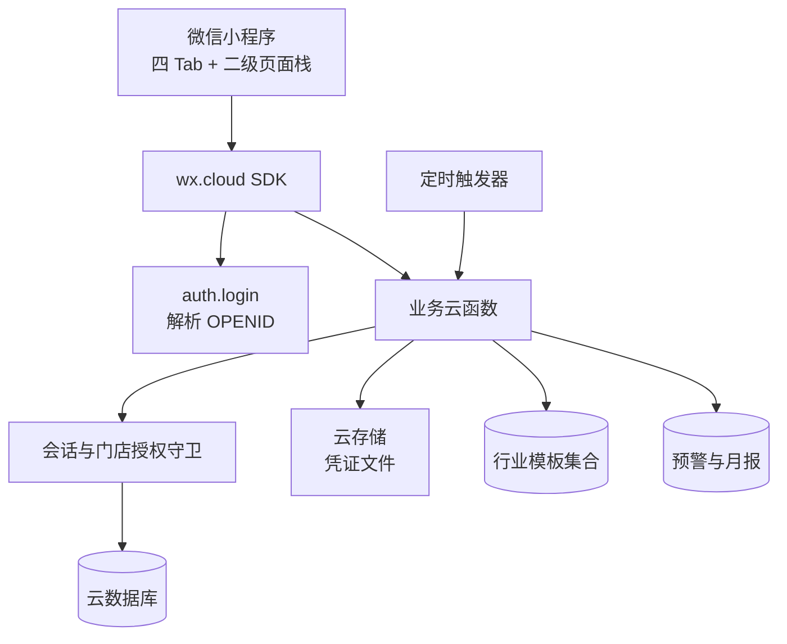

# 算得清：微信小程序化基础设计

**版本：** v1.0 · **状态：** 架构基线 · **适用范围：** 餐饮、零售、电商、美业服务、小商贩五类行业

> 本文将当前移动 Web App 的本地统一 Store 演进为微信云开发下的生产数据边界。它只定义认证、门店隔离、云数据库、云函数和迁移约束；页面仍保留现有的四 Tab 与二级页面栈信息架构。

## 1. 目标与边界

当前原型已经以 `industryId` 隔离流水、成本卡、供应商、分类与报表，并将模板作为业务语义的唯一来源。生产小程序必须保留这一原则，同时将浏览器 `localStorage` 的单端状态替换为云函数管理的多门店数据边界。行业切换采用“**未来数据使用新模板，历史数据保留原行业**”策略，不允许覆盖、重写或删除既有流水、成本卡和报表快照。[1] [2]

| 设计目标 | 生产约束 | 当前原型的映射 |
|---|---|---|
| 一套核心账本、五行业语义 | 所有业务对象带 `storeId`、`industryId` 与稳定业务 key | `workspaceId`、`industryId`、`categoryKey` |
| 多门店与员工协作 | 认证后由服务端解析活动门店，客户端不得自报越权 `storeId` | 当前单工作空间扩展为 `users.activeStoreId` |
| 行业模板可演进 | 模板与指标规则带 `version`，报表/成本卡锁定生成时版本 | `IndustryTemplate` + `templateVersion` |
| 成本计算可信 | BOM 重算、状态判定、预算/隐性成本聚合均在云函数执行 | `calcCard()` 和派生 selector 上移 |
| 可审计切换 | 切换前影响评估，切换后写日志和快照边界 | `switchLog` 扩展为持久集合 |

为减少命名歧义，**云端以 `storeId` 作为租户根字段**。现有 Web App 的 `workspaceId` 在迁移过程中映射为同值的 `storeId`，不同时保存两份租户字段。一个微信用户可拥有或加入多个门店，但任一业务请求只能在授权的活动门店范围内执行。

## 2. 目标架构



客户端仅负责表单输入、渲染、请求状态与页面跳转。`OPENID`、`userId`、活动门店成员权限和资源归属均由云函数从运行时上下文解析；客户端传入的 `storeId` 仅可作为“切换活动门店”的显式动作参数，不能作为任意查询的信任依据。[1]

## 3. 身份、门店与权限模型

### 3.1 角色和访问范围

| 角色 | 典型权限 | 不可执行的操作 |
|---|---|---|
| `owner` | 建店、切换行业、预算、成员、所有 CRUD、报表导出 | 无（仍受门店范围限制） |
| `manager` | 流水/成本卡/供应商/分类、预算、分析和报表查看 | 删除门店、转移所有权、管理 owner |
| `bookkeeper` | 流水 CRUD、凭证上传、供应商查看、分析查看 | 行业切换、预算、成本卡/BOM、成员管理 |
| `viewer` | 工作台、流水/成本卡/报表/分析只读 | 所有写操作与文件上传 |

门店成员关系使用独立集合而非写入 `users.storeIds` 数组，以支持角色、加入/停用时间与审计追踪。登录后，云函数优先使用用户已设置的 `activeStoreId`；若不存在，则选择该用户拥有的第一家门店，或返回 `NEED_ONBOARDING`。

### 3.2 服务端会话守卫

每一个业务云函数的首个动作必须执行会话解析和门店成员校验。任何按 `_id` 获取的资源也必须同时验证 `storeId`，防止通过猜测 ID 跨店读取或修改数据。

```ts
type Session = {
  userId: string;
  openid: string;
  storeId: string;
  role: "owner" | "manager" | "bookkeeper" | "viewer";
};

async function requireSession(requiredRoles?: Session["role"][]): Promise<Session> {
  // 1. cloud.getWXContext() 取得 OPENID
  // 2. users 查询用户，读取 activeStoreId
  // 3. store_members 查询 { storeId, userId, status: "active" }
  // 4. 校验角色；失败时抛出标准错误码
}
```

## 4. 云数据库 Schema

所有金额均使用**以分为单位的整数** `amountFen` 存储；时间由服务端写入；外部展示时再格式化为元。所有行业相关枚举使用稳定 ID（例如 `ecommerce`、`platform_fee`），而非依赖中文标签。分类与模板的展示名称可改变，但 key 不得被重用。[2]

| 集合 | 核心字段 | 关键索引 / 约束 | 说明 |
|---|---|---|---|
| `users` | `_id`、`openid`、`phone?`、`name?`、`activeStoreId?`、`createdAt` | `openid` 唯一 | 微信身份与最近活动门店 |
| `stores` | `_id`、`name`、`industryId`、`activeTemplateVersion`、`monthlyBudgetFen`、`ownerId`、`status` | `ownerId + status` | 商家/门店租户根对象 |
| `store_members` | `_id`、`storeId`、`userId`、`role`、`status`、`joinedAt` | `storeId + userId` 唯一 | 多门店成员与角色 |
| `industry_templates` | `id`、`version`、`nouns`、`categoryPresets`、`costCardSchema`、`hiddenCostModel` | `id + version` 唯一 | 平台维护的只读模板版本 |
| `categories` | `_id`、`storeId`、`industryId`、`templateVersion`、`key`、`label`、`color`、`status`、`sort` | `storeId + industryId + key` 唯一 | 每店行业分类实例 |
| `records` | `_id`、`storeId`、`industryId`、`templateVersion`、`categoryKey`、`type`、`amountFen`、`date`、`merchant`、`note?`、`status`、`attachmentIds`、`createdBy` | `storeId + industryId + date`；`storeId + merchant` | 收入、支出、退款主账 |
| `cost_cards` | `_id`、`storeId`、`industryId`、`templateVersion`、`entityType`、`name`、`salePriceFen?`、`unit`、`laborFen`、`overheadFen`、`computed`、`status` | `storeId + industryId + status` | 菜品/SKU/服务项目/货品成本卡 |
| `bom_items` | `_id`、`storeId`、`costCardId`、`name`、`spec?`、`quantity`、`amountFen`、`sort` | `costCardId + sort` | BOM 或成本构成明细 |
| `suppliers` | `_id`、`storeId`、`industryScope`、`name`、`contact?`、`phone?`、`categoryKeys`、`status` | `storeId + name` | 支持 `industryScope: ["shared"]` |
| `reports` | `_id`、`storeId`、`industryId`、`templateVersion`、`month`、`snapshot`、`status` | `storeId + industryId + month + templateVersion` 唯一 | 生成后不可被切换重算 |
| `attachments` | `_id`、`storeId`、`recordId`、`fileId`、`mimeType`、`size`、`uploadedBy` | `recordId` | 云存储凭证元数据 |
| `industry_switch_logs` | `_id`、`storeId`、`fromIndustryId`、`toIndustryId`、`strategy`、`impact`、`operatorId`、`occurredAt` | `storeId + occurredAt` | 行业切换审计事件 |
| `alerts` | `_id`、`storeId`、`industryId?`、`kind`、`payload`、`readAt?`、`createdAt` | `storeId + readAt` | 预算、成本、月报生成通知 |

### 4.1 `records`、`cost_cards` 与 `reports` 的快照边界

`records` 的 `industryId`、`templateVersion`、`categoryKey` 在创建后不可被行业切换批量改写。`cost_cards` 必须记录创建时模板版本；跨实体类型切换（如菜品转服务项目）只能创建新草稿。`reports.snapshot` 需包含分类汇总、趋势截点、TOP 实体和隐性成本模型版本，避免报表随模板配置变更而产生“历史数字漂移”。[2]

## 5. 统一云函数契约

所有云函数采用同一响应外壳，客户端通过一个 `call(name, data)` 门面访问，便于由 Web App 的 Store 适配到小程序数据层。请求中不接受受信任的 `userId`、`role` 或任意业务 `storeId`；这些字段均由服务端守卫补齐。

```ts
type ApiResult<T> =
  | { code: 0; data: T; requestId: string }
  | { code: string; message: string; requestId: string; details?: unknown };

type PageInput = { cursor?: string; limit?: number };
type PageResult<T> = { list: T[]; nextCursor?: string; total?: number };
```

| 错误码 | 含义 | 客户端行为 |
|---|---|---|
| `UNAUTHENTICATED` | 未能解析微信身份 | 静默重试登录；失败则显示登录引导 |
| `NEED_ONBOARDING` | 用户没有可用门店 | 跳转行业/门店创建向导 |
| `FORBIDDEN` | 非门店成员或角色不足 | 显示无权提示，不展示敏感数据 |
| `NOT_FOUND` | 资源不存在或不属于活动门店 | 返回列表并提示已不存在 |
| `VALIDATION_ERROR` | 金额、分类、日期或输入校验失败 | 标注具体字段 |
| `CONFLICT` | 名称重复、版本或状态冲突 | 刷新数据并引导重试 |
| `CATEGORY_IN_USE` | 分类仍关联流水或成本卡 | 禁止删除，提供归档/迁移入口 |
| `INDUSTRY_SWITCH_CONFIRM_REQUIRED` | 已有数据的行业切换未确认 | 展示影响评估和确认页 |

### 5.1 认证、门店与行业模板

| 云函数 | 请求 | 成功数据 | 服务端规则 |
|---|---|---|---|
| `auth.login` | `{}` | `{ user, stores, activeStore?, onboardingRequired }` | 由 `OPENID` 自动创建或读取用户 |
| `auth.bindPhone` | `{ code }` | `{ phone }` | 仅绑定当前用户，手机号不返回给其他成员 |
| `stores.create` | `{ name, industryId, monthlyBudgetFen }` | `{ store, categories }` | 创建 owner 成员、写模板分类和切换日志 |
| `stores.list` | `{}` | `{ list, activeStoreId }` | 仅返回当前用户 active 成员关系 |
| `stores.setActive` | `{ storeId }` | `{ activeStoreId }` | 必须验证成员关系后更新 users |
| `templates.list` | `{}` | `{ list }` | 仅返回受支持的五行业模板与版本 |
| `industry.impact` | `{ targetIndustryId }` | `{ source, target, counts, mappings, requiresConfirmation }` | 计算当前门店影响，不写数据 |
| `industry.switch` | `{ targetIndustryId, strategy, categoryMappings? }` | `{ store, log, refreshKeys }` | 原子执行，详见第 6 节 |

`stores.create` 是新商家首次选行业的入口：它以目标模板版本创建门店、预设分类和空业务数据。现有商家更换经营范围只能调用 `industry.impact` 后的 `industry.switch`，不能重复调用建店接口。

### 5.2 流水、凭证和预算

| 云函数 | 请求 | 成功数据 | 关键校验 |
|---|---|---|---|
| `records.list` | `{ industryId?, scope: "current"|"all", type?, categoryKey?, keyword?, cursor?, limit? }` | `PageResult<Record>` | 默认取活动行业；所有结果强制活动门店 |
| `records.create` | `{ type, amountFen, date, categoryKey, merchant, note?, attachmentIds? }` | `{ record, totals }` | 分类必须属于当前行业；服务端写 `industryId/templateVersion/createdBy` |
| `records.update` | `{ id, type, amountFen, date, categoryKey, merchant, note?, attachmentIds? }` | `{ record, totals }` | `_id + storeId` 校验；不得跨行业改写 |
| `records.remove` | `{ id }` | `{ ok: true, deletedAttachmentIds }` | 删除元数据及其云存储凭证，记录审计事件 |
| `attachments.uploadToken` | `{ recordDraftId?, mimeType, size }` | `{ cloudPath, uploadPolicy }` | 限制类型、大小与当前用户目录 |
| `budget.update` | `{ monthlyBudgetFen }` | `{ budget, budgetUsedRate }` | 仅 owner/manager；预算为正整数 |

> 凭证文件路径固定为 `receipts/{storeId}/{recordId-or-draftId}/{timestamp}.{ext}`。文件元数据必须在保存流水时归属到记录，列表不直接暴露永久访问 URL，而由详情页按需换取临时 URL。[1]

### 5.3 成本卡与 BOM

| 云函数 | 请求 | 成功数据 | 关键规则 |
|---|---|---|---|
| `costCards.list` | `{ status?, keyword?, cursor?, limit? }` | `PageResult<CostCard>` | 只返回活动行业兼容实体 |
| `costCards.detail` | `{ id }` | `{ card, bomItems, history }` | `_id + storeId + industryId` 校验 |
| `costCards.create` | `{ name, entityType, salePriceFen?, unit, laborFen, overheadFen, ...schemaFields }` | `{ card }` | 字段根据模板 `costCardSchema` 校验 |
| `bom.add` | `{ costCardId, name, spec?, quantity, amountFen }` | `{ card, bomItem }` | 写入后服务端重算单位成本、毛利率、状态和历史点 |
| `bom.remove` | `{ costCardId, bomItemId }` | `{ card }` | 仅删除本门店卡片的本门店 BOM 项并重算 |

BOM 计算必须使用云函数事务或等价的版本条件更新：先读取成本卡和当前 BOM 版本，再写 BOM 项，再根据完整明细计算 `materialFen`、`unitCostFen`、`marginRate` 与风险状态；若版本不一致则返回 `CONFLICT`。客户端不能提交计算后的成本或毛利率作为可信字段。[1]

### 5.4 分析、报表、供应商和分类

| 云函数 | 请求 | 成功数据 | 关键规则 |
|---|---|---|---|
| `overview.get` | `{ period? }` | `{ kpis, budget, riskNotes, categoryTotals, miniTrend }` | 当前活动行业实时聚合 |
| `analysis.get` | `{ period: "current"|"last", metric: "cost"|"margin"|"costRate" }` | `{ trend, composition, topEntities, suppliers, hiddenCosts }` | 隐性成本按模板 `modelVersion` 返回 |
| `reports.list` | `{ cursor?, limit? }` | `PageResult<MonthlyReport>` | 用 `industryId + templateVersion` 过滤，历史按原口径可查 |
| `reports.detail` | `{ id }` | `{ report }` | 返回不可变 `snapshot`，不得实时重算 |
| `reports.export` | `{ id, format: "pdf"|"xlsx" }` | `{ taskId, status }` | 异步生成，完成后写 alerts 与临时下载地址 |
| `suppliers.list` | `{ keyword?, includeShared?, cursor?, limit? }` | `PageResult<Supplier>` | 当前行业或 `shared` 范围 |
| `suppliers.create` | `{ name, contact?, phone?, categoryKeys, industryScope? }` | `{ supplier }` | 同店名称去重；scope 默认当前行业 |
| `suppliers.update/remove` | `{ id, ... }` / `{ id }` | `{ supplier }` / `{ ok }` | 与关联记录一致时优先归档而非硬删 |
| `categories.list` | `{ includeArchived? }` | `{ list }` | 默认当前行业的有效分类 |
| `categories.create` | `{ key?, label, color, expenseType }` | `{ category }` | 自定义 key 服务端生成；同店同业 key/名称唯一 |
| `categories.archive` | `{ id, replacementKey? }` | `{ ok, migratedCount? }` | 已关联数据时必须归档或显式迁移，不能静默删除 |

## 6. 行业切换事务

行业切换分为预览和提交两个函数。预览返回当前行业流水、活跃成本卡、供应商、未封存本月数据和可复用分类 key 的数量；提交必须携带确认策略。默认策略 `future_only` 不改写历史数据，只创建目标行业缺失预设分类、更新门店活动行业和写入审计日志。[2]

```ts
type IndustrySwitchInput = {
  targetIndustryId: "canteen" | "retail" | "ecommerce" | "beauty" | "stall";
  strategy: "future_only" | "manual_mapping";
  categoryMappings?: Record<string, string>;
  confirmedImpactHash: string;
};

async function switchIndustry(session: Session, input: IndustrySwitchInput) {
  const impact = await getImpact(session.storeId, input.targetIndustryId);
  assert(input.confirmedImpactHash === impact.hash, "CONFLICT");

  await db.runTransaction(async (tx) => {
    const template = await tx.getTemplate(input.targetIndustryId);
    await tx.upsertPresetCategories(session.storeId, template);
    await tx.applyExplicitMappings(session.storeId, input.categoryMappings ?? {});
    await tx.updateStore(session.storeId, {
      industryId: input.targetIndustryId,
      activeTemplateVersion: template.version,
      switchedAt: serverDate(),
    });
    await tx.insertSwitchLog({ storeId: session.storeId, ...input, impact, operatorId: session.userId });
  });

  return { refreshKeys: ["store", "overview", "records", "costCards", "analysis", "suppliers", "categories", "reports"] };
}
```

报表和月度图表采用“生成时冻结”原则。行业切换后的新数据以新行业和新模板版本统计；已有报表仅可查看、导出和标记，不因当前门店行业变化而重算。[2]

## 7. 聚合、定时任务与一致性

| 场景 | 执行位置 | 写入结果 |
|---|---|---|
| 新增/更新/删除流水 | `records.*` 云函数同步 | 更新账本派生摘要缓存或使缓存失效；必要时生成预算预警 |
| BOM 增删 | `bom.*` 云函数同步 | 重算成本卡成本、毛利率、状态和最近成本趋势点 |
| 工作台/分析页 | `overview.get`、`analysis.get` | 小数据量实时聚合；大数据量可读按月摘要缓存 |
| 每月月结 | `monthlyReport` 定时触发器 | 按 `storeId + industryId + templateVersion + month` 生成唯一 report snapshot |
| 预算阈值 | 流水写入后与定时扫描 | 写入 `alerts`，避免在客户端重复弹窗 |
| 报表导出 | 异步 `reports.export` | 写入导出任务/通知，文件放云存储并提供临时地址 |

所有写操作需支持客户端重试：客户端生成 `clientRequestId`，云函数在 `operation_logs`（可作为附加集合）中记录 `storeId + clientRequestId + action` 的处理结果，同一请求重复到达时返回首次成功结果，防止弱网环境下重复记账或重复添加 BOM。

## 8. 小程序数据层迁移方式

页面层不应直接依赖云函数名。建议新增 `services/costBookApi.ts`，使其实现与当前 `useCostBook()` 相同的业务语义，并在开发阶段提供 `local` 与 `cloud` 两种适配器。

| 当前 Web App 动作 | 小程序数据层动作 | 云端执行点 |
|---|---|---|
| `addRecord` / `updateRecord` / `removeRecord` | `records.create` / `records.update` / `records.remove` | 记录状态、预算和预警 |
| `addBomItem` / `removeBomItem` | `bom.add` / `bom.remove` | 成本、毛利和趋势重算 |
| `switchIndustry` | `industry.impact` → `industry.switch` | 模板分类、日志与缓存失效 |
| `updateBudget` | `budget.update` | 预算权限与占用率 |
| `add/removeSupplier` | `suppliers.create/archive` | 关联记录保护 |
| `add/removeCategory` | `categories.create/archive` | 占用检查与显式迁移 |

迁移期间，原型演示数据可以保留在本地适配器中，但不得与生产云端数据混用。首次启用云端的用户需完成登录、门店创建和行业引导；已存在的演示数据应被标识为“演示数据”，只可一键导入为新门店种子，不自动上传到真实门店。

## 9. 安全与验收清单

云数据库权限应禁止客户端直连业务集合进行任意读写；客户端仅通过云函数访问业务数据。云函数使用管理员权限时必须完整执行本文件的会话、成员、角色与 `storeId` 资源归属校验。凭证文件的云路径和临时访问 URL均以门店与记录为粒度隔离。[1]

| 验收场景 | 预期结果 |
|---|---|
| 两个不同门店成员查询流水 | 即使知道对方记录 ID，也只能读取本门店记录；返回 `NOT_FOUND` 或 `FORBIDDEN` |
| 电商切换到美业 | 电商流水、SKU 成本卡、月报保持原 `industryId/templateVersion`；美业生成产品耗材、技师工资等分类 |
| BOM 并发编辑 | 仅一个版本提交成功；另一个收到 `CONFLICT` 后刷新详情再提交 |
| 删除已被流水使用的分类 | 返回 `CATEGORY_IN_USE`，提供归档或显式迁移而非硬删除 |
| 弱网重复提交记账 | 相同 `clientRequestId` 只生成一条流水 |
| 员工切换活动门店 | 后续工作台、记录、分析、成本卡和报表全部来自新门店，不残留旧门店缓存 |
| 月结后行业切换 | 已生成报表数据不变；新行业从切换日期起独立汇总 |

## 10. 分阶段实施建议

第一阶段先完成 `auth.login`、`stores.create/setActive`、模板集合、会话守卫、分类初始化及流水 CRUD，以使当前四 Tab 页面拥有安全的真实数据来源。第二阶段接入成本卡、BOM、供应商与分类归档，再将计算逻辑上移。第三阶段实施分析聚合、隐性成本、月结报表、导出任务和预算预警。最后进行真机登录、多门店隔离、凭证上传、弱网重试和行业切换回归。

这一顺序延续了现有原型“统一数据层优先、成本计算上移、图表和报表复用同一查询边界”的实现原则。[1] [2]

## 参考资料

[1]: https://github.com/kimfatman/cost-book/blob/main/cost-book-mini/docs/07-wechat-cloud-guide.md "微信云开发接入改造方案（仓库文档）"
[2]: ./industry-template-spec.md "五行业模板切换与数据结构规格"
